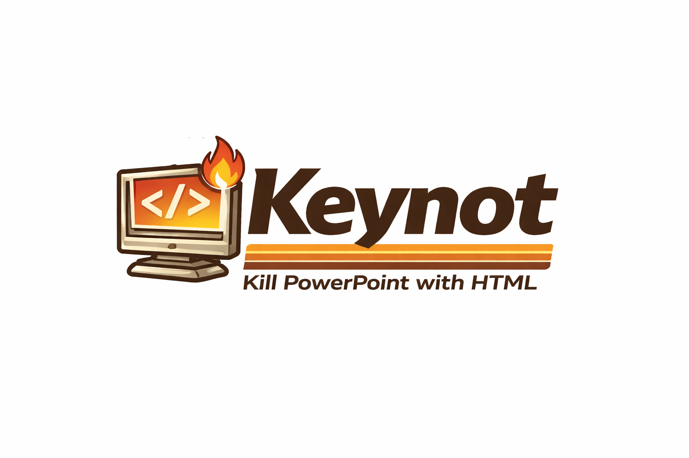
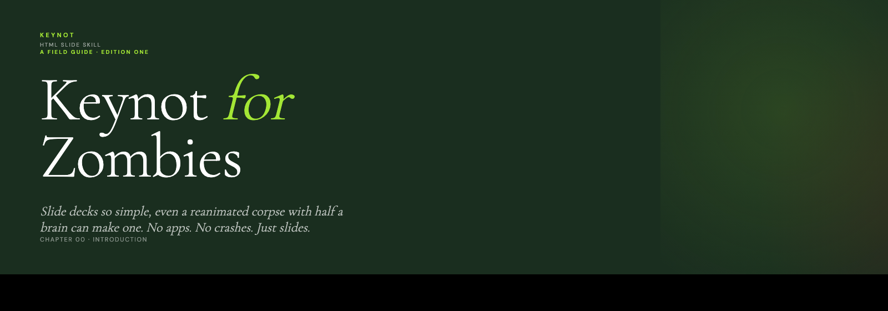

<p align="center">
  
</p>

<h1 align="center">keynot</h1>

<p align="center">
  <strong>kill powerpoint with html.</strong>
</p>

<p align="center">
  <a href="https://github.com/shawnzam/keynot/stargazers"></a>
  <a href="https://github.com/shawnzam/keynot/commits/main"></a>
  <a href="LICENSE"></a>
</p>

<p align="center">
  <a href="#what-it-does">What</a> •
  <a href="#install">Install</a> •
  <a href="#how-to-use">How</a> •
  <a href="#whats-in-the-skill">Inside</a> •
  <a href="#when-not-to-use">Caveats</a>
</p>

---

A [Claude Code](https://docs.anthropic.com/en/docs/claude-code) skill that turns any prompt into a polished, self-contained HTML slide deck — keyboard navigation, swipe, fullscreen, animated reveals, brand-accurate design. Single file. Opens anywhere. No runtime dependencies.

Built for the moment you need to present something and you don't want to open PowerPoint. Read the writeup: [**Stop Reaching for PowerPoint**](https://zamechek.com/blog/stop-reaching-for-powerpoint/).

## Live demo

<p align="center">
  <a href="https://shawnzam.github.io/keynot/examples/keynot-for-zombies.html">
    
  </a>
</p>

<p align="center">
  <a href="https://shawnzam.github.io/keynot/examples/keynot-for-zombies.html"><strong>→ Open the live deck</strong></a><br />
  <em>Arrow keys or swipe to navigate · press <code>f</code> for fullscreen</em>
</p>

Generated from a single prompt: *"keynot, but if the audience was zombies, and lean into it."* Everything — nav, fullscreen, animations, typography, all five slides — is one HTML file. [Source](examples/keynot-for-zombies.html).

## What it does

Ask Claude for "slides", "a deck", or "something to present" and keynot activates. You get one HTML file with:

- **Navigation** — arrow keys, space, swipe on touch, clickable dot indicators, auto-hiding nav bar
- **Fullscreen** — `f` key or click the fullscreen button
- **Staggered reveals** — content fades up in sequence on each slide
- **Brand theming** — CSS variables for primary/accent/typography swap in seconds
- **Layout library** — split panels, stat columns, value cards, approach rows, photo panels
- **Embedded assets** — fonts via CDN, images via base64 — one file, no broken links
- **PDF export** — `Cmd+P` → Save as PDF gives one slide per page, backgrounds intact, no extra tooling

## Before / After

<table>
<tr>
<td width="50%">

### 🪟 Old way

> "Open PowerPoint. Pick a template. Fight the master slide. Realize your brand colors aren't in the theme. Export to PDF. Send a 40MB file. Hope the fonts render."

</td>
<td width="50%">

### 🗂️ keynot

> "Make me a deck on X, use our brand guide." → one `deck.html`, double-click to open, press `f` for fullscreen, done.

</td>
</tr>
</table>

## Install

### Option A — Via `/plugin` (recommended)

keynot ships its own Claude Code plugin marketplace. Add it once, install the plugin:

```
/plugin marketplace add shawnzam/keynot
/plugin install keynot@keynot-marketplace
```

That's it. The skill is now available in every Claude Code session.

#### Updating

```
/plugin marketplace update keynot-marketplace
/plugin install keynot@keynot-marketplace
/reload-plugins
```

Self-hosted marketplaces don't auto-update. Run these whenever you want to pull the latest.

### Option B — Drop-in SKILL.md (no plugin manifest)

If you just want the skill without the plugin wrapper:

```bash
# User-scoped (available everywhere)
mkdir -p ~/.claude/skills/keynot
curl -fsSL https://raw.githubusercontent.com/shawnzam/keynot/main/skills/keynot/SKILL.md \
  -o ~/.claude/skills/keynot/SKILL.md

# Or project-scoped
mkdir -p .claude/skills/keynot
curl -fsSL https://raw.githubusercontent.com/shawnzam/keynot/main/skills/keynot/SKILL.md \
  -o .claude/skills/keynot/SKILL.md
```

Then restart Claude Code.

### Option C — As a reference

The `SKILL.md` file is self-contained. Read it, copy the CSS/JS shell, and build decks by hand if you prefer.

## How to use

Once installed, just ask:

```
Make me a 5-slide deck introducing our new product.
Brand guide is attached.
```

```
Turn this doc into slides.
```

```
I need something to present tomorrow on the roadmap.
Dark theme, serif headings.
```

keynot will extract brand parameters (colors, type, layout language), pick a slide sequence that matches your goal, and ship a single `.html` file you can open in any browser.

## Exporting to PDF

Every generated deck ships with a `@media print` block that un-stacks absolutely-positioned slides, kills animations, hides the nav bar, and sets `@page` to landscape. Result: open the deck, hit `Cmd+P` (`Ctrl+P` on Windows/Linux), pick "Save as PDF" — you get one slide per page with backgrounds and typography intact. No external tools.

See a generated example: [**keynot-for-zombies.pdf**](examples/keynot-for-zombies.pdf) — the zombies demo deck exported straight from Chrome's print dialog.

**Tip:** enable "Background graphics" in the print dialog if it's off by default, and pick a landscape paper size (or let the browser fit to the `1600 × 1000` `@page` rule). Firefox handles pixel-based `@page size` less reliably than Chrome/Safari — if output looks wrong there, the skill docs include a physical-units fallback.

## Example use cases

- **Investor or pitch decks** — Paste your narrative, drop in a brand guide, get a polished deck in minutes. Iterate in plain English instead of wrestling with slide masters.
- **Conference talks & tech demos** — Single HTML file that opens anywhere, runs offline, and won't embarrass you when the venue wifi dies. Keyboard nav and fullscreen are already wired up.
- **Internal readouts & weekly updates** — Turn a status doc into a skimmable deck so your team actually reads it. Swap content in seconds when numbers change.
- **Client one-pagers** — Match any client's brand from a PDF style guide and deliver something that looks bespoke without opening Figma.
- **Workshop & teaching slides** — Build a course deck with embedded images, staggered reveals, and deep-linkable slide URLs. Students open it in their browser, no installs.
- **Sales leave-behinds** — Ship a self-contained `.html` that prospects can forward internally. No broken fonts, no missing assets, no "please install our viewer."
- **Portfolio & case studies** — Present past work with editorial-quality typography and layouts that match each project's brand.

## What's in the skill

The [`SKILL.md`](skills/keynot/SKILL.md) file walks Claude through:

1. **Brand extraction** — how to parse a style guide (PDF, URL, description) into CSS variables
2. **Deck architecture** — the single-file HTML shell with all navigation and fullscreen wired up
3. **Layout patterns** — split panels, stat columns, value cards, approach rows, tool cards, photo panels
4. **Content sequencing** — a proven 5-slide structure for introductions and pitches
5. **Typography rules** — display, heading, eyebrow, and body tokens with `clamp()` scaling
6. **Iteration workflow** — how to make surgical edits without corrupting JavaScript
7. **Pitfalls** — JS operator corruption from blanket regex, base64 sizing, emoji hygiene

## When not to use

- **PowerPoint is required** — your audience needs to edit in Office. Use `.pptx` instead.
- **You need real-time collaboration** — Google Slides wins here.
- **Heavy animations or transitions** — keynot does opacity fades and staggered reveals, not 3D cube transitions.
- **Video embeds** — possible, but bloats the single-file deck quickly.
- **Portrait mobile viewing** — decks are landscape-first. Phones held vertically see a "rotate your device" overlay; landscape phone viewing works fine.

For everything else — pitches, one-pagers, internal readouts, conference talks, lunch-and-learns — keynot ships faster and looks sharper than the alternatives.

## License

MIT — see [LICENSE](LICENSE).
